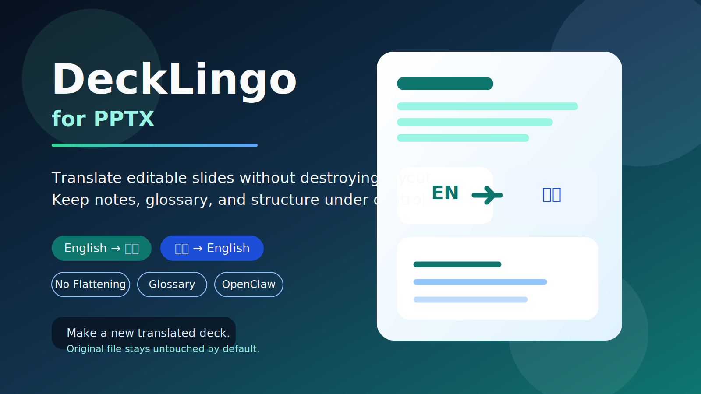

# DeckLingo for PPTX



Translate editable PowerPoint decks into your chosen language while keeping layout, terminology, and editability as stable as possible.

Available on ClawHub:

```bash
clawhub install decklingo-pptx
```

## Choose Your Language

- [English](#english)
- [中文](#中文)

## English

DeckLingo for PPTX translates editable PowerPoint decks without flattening the slides. It supports English to Chinese, Chinese to English, glossary-aware terminology control, selective translation of notes, layouts, and masters, and verification after translation.

### What It Does

DeckLingo is made for real presentation files, not screenshots pretending to be presentations. It opens a `.pptx`, finds editable text, translates it, and writes the result back into a new PowerPoint file.

That means:

- your translated deck stays editable
- slide order stays the same
- notes can be translated too
- layouts and masters can be included when you want a deep cleanup
- repeated technical terms can stay consistent through a glossary

### What It Does Not Do

- It does not redesign your slides for you.
- It does not magically translate text inside flattened images.
- It does not overwrite your original PPT by default.

### Very Important Safety Rule

By default, you should always write the translated result to a new file, such as:

```bash
lecture.en.pptx
lecture.zh-CN.pptx
```

This keeps the original deck safe. If you ever choose in-place output, make a backup first.

### Why This Is Useful

Most PowerPoint translation workflows are painful. People either:

- copy and paste slide by slide
- destroy the layout
- convert slides into images
- forget speaker notes
- end up with inconsistent terminology

DeckLingo tries to solve the practical version of the problem: make translation useful without making the deck unusable afterward.

### Simple Example

Scan a deck first:

```bash
python scripts/scan_pptx_text.py \
  --input "lecture.pptx" \
  --source-lang en \
  --include-notes
```

Translate to a new Chinese file:

```bash
python scripts/translate_pptx_text.py \
  --input "lecture.pptx" \
  --output "lecture.zh-CN.pptx" \
  --source-lang en \
  --target-lang zh-CN \
  --ui-lang zh \
  --include-notes \
  --report-file "lecture.translation-report.json"
```

### When You Should Use It

- You have a real `.pptx` file with editable text.
- You want to translate slides while keeping the structure intact.
- You need English to Chinese or Chinese to English often.
- You care about notes, layouts, masters, or terminology.

### When You Should Not Use It

- Your deck is basically a pile of screenshots.
- You need a visual redesign instead of translation.
- You want a one-click perfect publishing workflow with no review at all.

## 中文

DeckLingo for PPTX 用来翻译可编辑的 PowerPoint，而不是把整套幻灯片打平成图片后再替换文字。它支持英文转中文、中文转英文、术语表控制、备注、版式和母版的选择性翻译，以及翻译后的校验。

### 这个项目是做什么的

DeckLingo 不是把幻灯片转成图片后再硬改文字，而是直接处理 `.pptx` 里的可编辑文本，然后把翻译结果写回新的 PowerPoint 文件。

这意味着：

- 翻译后的 PPT 还是可以继续编辑
- 幻灯片顺序不会乱
- 演讲备注也可以一起翻译
- 如果你需要，也可以连版式和母版一起处理
- 专业术语可以通过术语表保持一致

### 它不做什么

- 它不是自动美化 PPT 的工具
- 它不能完美识别图片里已经烘焙进去的文字
- 它默认不应该覆盖原始 PPT

### 很重要的一条原则

默认请始终输出到一个新文件，不要覆盖原始 PPT。比如：

```bash
lecture.en.pptx
lecture.zh-CN.pptx
```

这样最安全。原文件保留，出问题也能随时回退。

### 为什么这个工具有价值

很多人做 PPT 翻译时都会遇到这些问题：

- 一页一页手工复制，效率很低
- 翻译完排版乱掉
- 备注忘了翻
- 母版里还残留原语言
- 前后术语不统一

DeckLingo 解决的是“实际工作里真的会痛”的这部分问题：尽量让翻译后的 PPT 还能继续用，而不是只得到一份勉强能看的结果。

### 一个通俗的用法

先扫描：

```bash
python scripts/scan_pptx_text.py \
  --input "lecture.pptx" \
  --source-lang en \
  --include-notes
```

再翻译成新的中文文件：

```bash
python scripts/translate_pptx_text.py \
  --input "lecture.pptx" \
  --output "lecture.zh-CN.pptx" \
  --source-lang en \
  --target-lang zh-CN \
  --ui-lang zh \
  --include-notes \
  --report-file "lecture.translation-report.json"
```

### 什么时候适合用

- 你手上有真正的 `.pptx` 文件
- 你想保留原有结构和大部分版式
- 你经常要做中英双向翻译
- 你很在意备注、母版和术语统一

### 什么时候不适合用

- 你的 PPT 大部分文字都在图片里
- 你真正要的是重新设计一套视觉稿
- 你希望完全不用人工复核就直接交付正式出版物

## 日本語

DeckLingo for PPTX は、スライドを画像化せずに編集可能な PowerPoint をそのまま翻訳するためのツールです。英語から中国語、中国語から英語、用語集による用語統一、ノート、レイアウト、マスターの選択翻訳、翻訳後の検証に対応しています。

## Runtime Compatibility

- Codex-style skill runtimes
- OpenClaw-style local agent platforms
- Any local agent system that can read `SKILL.md` and execute Python scripts

Platform notes are in [references/platform-compatibility.md](./references/platform-compatibility.md).

## Real Example Prompts

- Translate this PowerPoint from English to Simplified Chinese and keep all speaker notes editable.
- Convert this Chinese lecture deck into fluent English, but keep file names, URLs, and numbers unchanged.
- Localize this PPTX into Japanese using my glossary and tell me if any source-language text remains in layouts or masters.

## Project Structure

- [SKILL.md](./SKILL.md): primary skill instructions
- [agents/openai.yaml](./agents/openai.yaml): marketplace-style metadata
- [scripts/scan_pptx_text.py](./scripts/scan_pptx_text.py): preflight scan
- [scripts/translate_pptx_text.py](./scripts/translate_pptx_text.py): translation entrypoint
- [assets/glossary.sample.json](./assets/glossary.sample.json): sample glossary
- [assets/skip_patterns.sample.txt](./assets/skip_patterns.sample.txt): sample protected-text rules

## Validation

Validated locally on:

- `4.  Microbial metabolism 2026.pptx`
- Workflow: `English -> zh-CN`
- Result: scan succeeded, translation succeeded, output deck written, verification passed

## OpenClaw / ClawHub Notes

- Discovery depends on name, description, tags, and usage signals, not only exact keyword matches.
- This repository uses search-friendly copy so users can find it with natural tasks like "translate PowerPoint to Chinese".
- For publishing, use:

```bash
clawhub publish ./DeckLingo-for-PPTX --slug decklingo-pptx --name "DeckLingo for PPTX" --version 1.0.0 --changelog "Initial public release" --tags latest,pptx,powerpoint,translation,localization,slides,english-to-chinese,chinese-to-english,glossary,openclaw,codex
```

## Marketplace Copy

Multi-language listing copy is available in [references/market-listing.md](./references/market-listing.md).

## Changelog

See [references/changelog.md](./references/changelog.md).

## Author

Yang Yiheng  
yangyiheng00711@gmail.com
